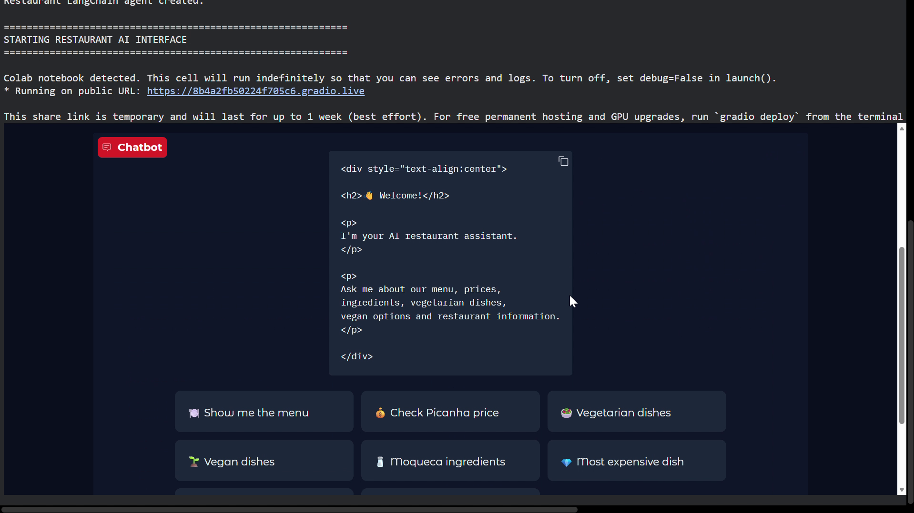

# 🍽️ Brazilian Restaurant Intelligence Chatbot

<p align="center">
  <a href="https://drive.google.com/file/d/1D_J0ZTKePZFMOggbeQi3CZwiQTw8fLYY/view?usp=sharing" target="_blank">
    
  </a>
  <br/>
  <em>🎥 Click the preview image above to watch the full interactive video demo on Google Drive</em>
</p>

<p align="center">
  <a href="https://drive.google.com/file/d/1D_J0ZTKePZFMOggbeQi3CZwiQTw8fLYY/view?usp=sharing"></a>
  
  
  
  
  
  
  
</p>

An intelligent, multilingual **Retrieval-Augmented Generation (RAG)** assistant for a Brazilian restaurant built with **LangChain**, **Groq**, **ChromaDB**, **HuggingFace Embeddings**, and **Gradio**.

The chatbot ingests operational guidelines and authentic Portuguese menus from PDFs, translates the menu to English using strict boundary constraints, indexes semantic vectors into ChromaDB, and delivers grounded answers to customer inquiries using retrieved restaurant documents and strict anti-hallucination guardrails.

---

## 🌟 Key Features

* **🛡️ Strict Grounding Guardrails**: Uses explicit grounding rules to restrict responses to information retrieved from the restaurant documents and handles unsupported questions without fabricating restaurant-specific information.
* **🌐 Cross-Lingual Translation**: Automatically translates Portuguese menu content to English while preserving authentic Brazilian dish names, exact prices, and dietary tags (`[Vegetariano]`, `[Vegano]`).
* **⚡ Fast LLM Inference**: Uses Groq-hosted `openai/gpt-oss-120b` for responsive conversational interactions. The model can be configured using the `GROQ_MODEL` environment variable.
* **🧠 Dense Vector Retrieval**: Uses `sentence-transformers/all-mpnet-base-v2` dense embeddings and ChromaDB vector search (`k=4`) for high-accuracy semantic matching.
* **🎨 Clean Gradio Interface**: Soft-themed UI (`red`/`orange`/`slate`) equipped with ready-to-test customer inquiry chips.

---

## 📂 Repository Structure

```text
restaurant-intelligence-chatbot/
│
├── app.py                      # Main RAG pipeline, agent & Gradio interface
├── requirements.txt            # Project dependencies
├── README.md                   # Documentation & setup guide
├── .gitignore                  # Git exclusion rules (.env, chroma databases, etc.)
├── .env.example                # Template for environment variables
├── restaurant_briefing.pdf     # Restaurant operational rules, hours & policies
├── restaurant_menu.pdf         # Authentic Portuguese restaurant menu
└── screenshot.png              # Interface preview screenshot
